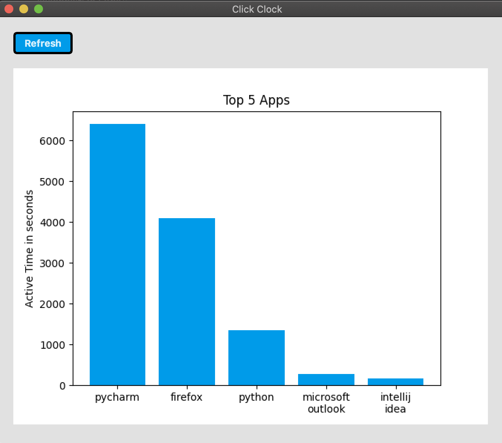

# Click Clock

A productivity app that tracks your laptop screen-time and analyzes app usage patterns automatically in the background. 
Dashboards with usage data and productivity tips are available in the desktop app. 

**Tech stack:** Python, SQL

**Libraries:** PyQt5, AppKit, Matplotlib, brotab

